# Flowchart Sistem Akuntansi UMKM

Dokumen flowchart berdasarkan DBML `akuntansi_umkm` — **sinkron 2026-09-16** dengan sistem saat ini:
- **Pagination 10/page** untuk semua list: `businesses`, `journals`, `products`, `customers`, `suppliers`, `cash_bank_accounts`, `sales_invoices`, `purchase_invoices`, `receipts`, `purchase_payments`, `stock_movements`, `fixed_assets`, `asset_depreciations`, **reports** (`sales`, `purchase`, `stock`, `fixed_assets`) dan **riwayat transfer** `GET /cash-bank-transfers` (filter `journalNo startsWith JU-TRF-`).
- **Penomoran auto prefix client**: `invoiceNo`, `receiptNo`, `paymentNo` bisa manual atau `prefix` dari client (`SI`, `PB`, `RC`, `PP` bebas 1-20 char) → sistem generate `{prefix}{001}` urut global per `businessId` per prefix per tabel via `src/common/utils/numbering.js` (`getNextNoTx` cari `MAX(prefix+angka)` +1, `padStart(3,'0')`). `journalNo` tetap auto `JU-SALES-*`, `JU-PURCHASE-*`, `JU-RECEIPT-*`, `JU-PAYMENT-*`, `JU-MANUAL-*`, `JU-TRF-*`, `JU-DEP-*`.

## 1. Flowchart Utama

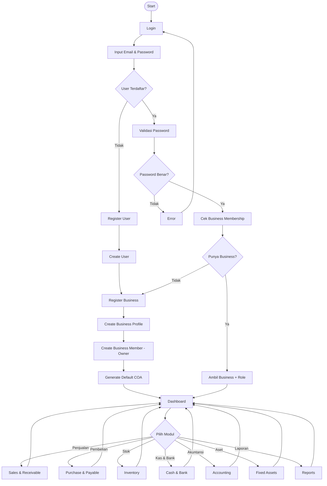

## 2. Authentication & Business Onboarding

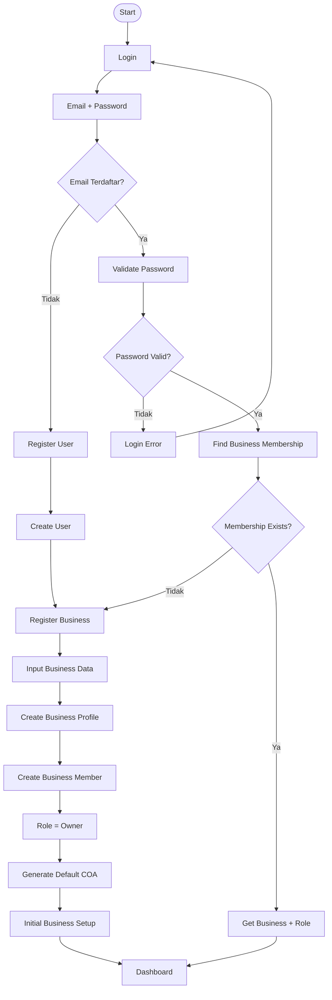

## 3. Penjualan (dengan penomoran prefix auto & pagination)

```mermaid
flowchart TD
    A([Start]) --> B[Pilih Penjualan]
    B --> B1{invoiceNo / prefix?}
    B1 -->|Manual invoiceNo| B2[Validasi invoiceNo 1-50, unique per business]
    B1 -->|Auto prefix| B3[Validasi prefix 1-20, cari MAX prefix+angka per businessId di sales_invoices, generate {prefix}{001} padStart 3]
    B2 --> C
    B3 --> C
    C[Pilih / Input Customer] --> D[Pilih Product]
    D --> E[Input Quantity]
    E --> F[Ambil Selling Price]
    F --> G[Hitung Subtotal]
    G --> H[Hitung Discount]
    H --> I[Hitung Tax]
    I --> J[Hitung Total]
    J --> K{Stock Cukup?}
    K -->|Tidak| L[Stock Tidak Cukup]
    L --> D
    K -->|Ya| M[Create Sales Invoice - invoiceNo final]
    M --> N[Create Invoice Lines]
    N --> O[Kurangi Stock]
    O --> P[Create Stock Movement - movementType out]
    P --> Q{Pembayaran?}
    Q -->|Belum| R[Invoice Posted - status posted]
    Q -->|Sudah| S[Create Receipt - receiptNo auto/prefix RC atau manual]
    S --> T[Update Paid Amount]
    T --> U[Update Invoice Status - partially_paid/paid]
    R --> V[Create Journal JU-SALES-{Date.now()}-{businessId}]
    U --> V
    V --> W[Debit AR 1100]
    W --> X[Credit Sales Revenue 4010]
    X --> Y[Record COGS - validasi debit==credit]
    Y --> Z[Update Inventory]
    Z --> AA([Selesai])
    AA --> AB[List / Riwayat Penjualan - GET /sales-invoices?page=1&limit=10 - pagination 10/page + search invoiceNo/customer + filter status]
```

## 4. Pembelian (prefix auto & pagination)

```mermaid
flowchart TD
    A([Start]) --> B[Pilih Pembelian]
    B --> B1{invoiceNo / prefix?}
    B1 -->|Manual| B2[Validasi invoiceNo 1-50, unique per business]
    B1 -->|Auto| B3[prefix client - default PB - MAX PB+angka per businessId -> {prefix}{001}]
    B2 --> C
    B3 --> C
    C[Pilih / Input Supplier] --> D[Pilih Product]
    D --> E[Input Quantity]
    E --> F[Input Purchase Price]
    F --> G[Hitung Subtotal]
    G --> H[Hitung Discount]
    H --> I[Hitung Tax]
    I --> J[Hitung Total]
    J --> K[Create Purchase Invoice - invoiceNo final]
    K --> L[Create Invoice Lines]
    L --> M[Tambah Stock]
    M --> N[Create Stock Movement - movementType in]
    N --> O{Pembayaran?}
    O -->|Belum| P[Invoice Posted]
    O -->|Sudah| Q[Create Purchase Payment - paymentNo auto/prefix PP atau manual]
    Q --> R[Update Paid Amount]
    R --> S[Update Invoice Status - partially_paid/paid]
    P --> T[Create Journal JU-PURCHASE-{Date.now()}-{businessId}]
    S --> T
    T --> U[Debit Inventory 1500]
    U --> V[Credit AP 2010 - validasi debit==credit]
    V --> W([Selesai])
    W --> X[List / Riwayat Pembelian - GET /purchase-invoices?page=1&limit=10 - pagination 10/page]
```

## 5. Inventory / Stock (pagination 10/page)

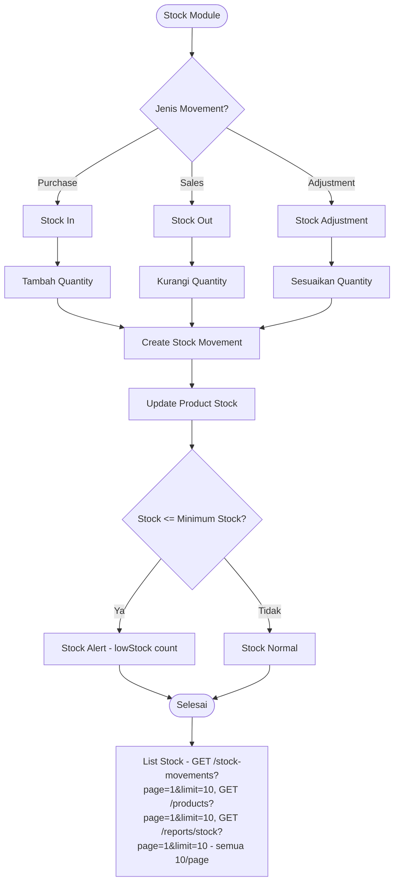

## 6. Kas & Bank (transfer + riwayat pagination 10/page)

```mermaid
flowchart TD
    A([Kas & Bank]) --> B{Jenis Transaksi?}
    B -->|Pemasukan| C[Cash In via Receipt - receiptNo auto RC / manual]
    B -->|Pengeluaran| D[Cash Out via Purchase Payment - paymentNo auto PP / manual]
    B -->|Transfer| E[Transfer Antar Akun]
    C --> F[Input Amount + prefix client jika auto]
    D --> G[Input Amount + prefix client jika auto]
    E --> H[Pilih Source Account]
    H --> I[Pilih Destination Account]
    I --> J[Input Amount + Validasi source!=dest & amount>0]
    F --> K[Create Journal - JU-RECEIPT-*, JU-PAYMENT-*]
    G --> K
    J --> K2[Create Journal JU-TRF-{Date.now()}-{businessId} - Debit dest.coa, Credit source.coa, validasi debit==credit]
    K2 --> L[Update Cash / Bank Balance via COA]
    K --> L
    L --> M[Create Journal Lines - include coa]
    M --> N([Selesai])
    N --> O[Riwayat Transfer - GET /cash-bank-transfers?page=1&limit=10 - filter journalNo startsWith JU-TRF-, search, from/to, pagination 10/page]
    O --> P[List Cash Bank Accounts - GET /cash-bank-accounts?page=1&limit=10]
```

## 7. Accounting / Jurnal (pagination 10/page)

```mermaid
flowchart TD
    A([Accounting]) --> B{Sumber Transaksi?}
    B -->|Penjualan| C[Sales Journal JU-SALES-*]
    B -->|Pembelian| D[Purchase Journal JU-PURCHASE-*]
    B -->|Penerimaan| E[Receipt Journal JU-RECEIPT-*]
    B -->|Pembayaran| F[Payment Journal JU-PAYMENT-*]
    B -->|Transfer| G2[Transfer Journal JU-TRF-*]
    B -->|Penyusutan| G[Depreciation Journal JU-DEP-*]
    B -->|Manual| H[Manual Journal JU-MANUAL-*]
    C --> I[Create Journal - journalNo auto Date.now()+businessId]
    D --> I
    E --> I
    F --> I
    G2 --> I
    G --> I
    H --> I
    I --> J[Create Journal Lines - debit/credit per COA]
    J --> K{Debit = Credit?}
    K -->|Tidak| L[Journal Error - 400 Journal tidak balance]
    L --> M[Edit Journal]
    M --> J
    K -->|Ya| N[Post Journal - status posted]
    N --> O([Selesai])
    O --> P[List Jurnal - GET /journals?page=1&limit=10 - filter status/search/from/to, pagination 10/page, meta]
```

## 8. Piutang / Receivable (auto prefix RC)

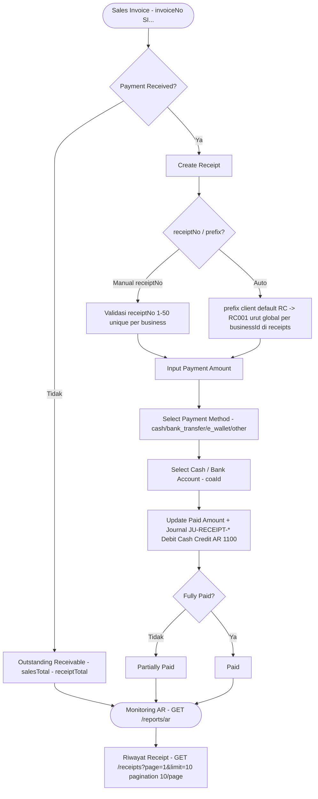

## 9. Hutang / Payable (auto prefix PP)

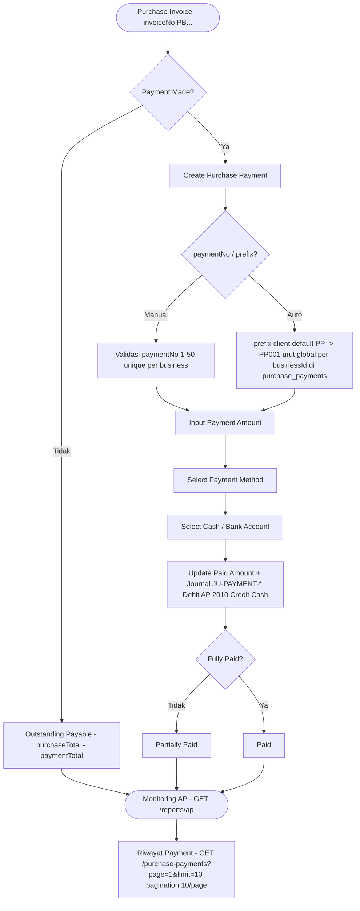

## 10. Fixed Asset & Depreciation

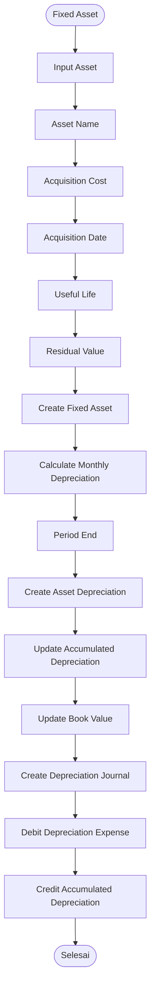

Rumus penyusutan garis lurus:

```text
Depreciation = (Acquisition Cost - Residual Value) / Useful Life
```

## 11. Chart of Accounts

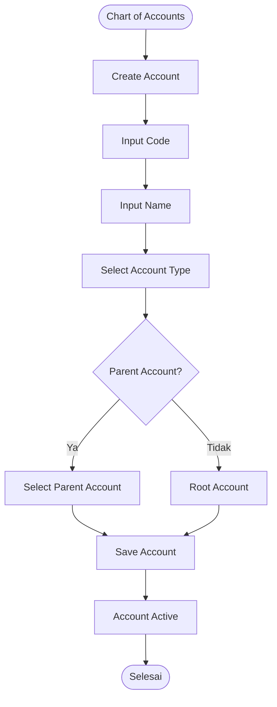

## 12. Tax

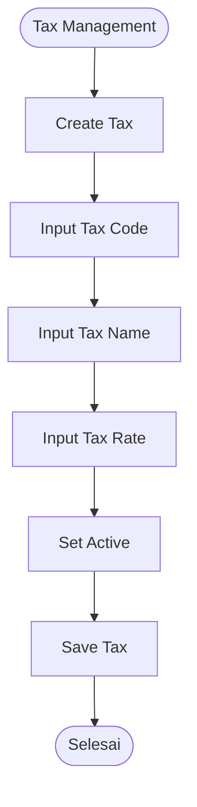

## 13. Dashboard

```mermaid
flowchart TD
    A([Dashboard]) --> B[Select Period]
    B --> C[Load Business Data]
    C --> D[Calculate Omzet]
    C --> E[Calculate Revenue]
    C --> F[Calculate Expense]
    C --> G[Calculate Profit / Loss]
    C --> H[Calculate Cash & Bank]
    C --> I[Calculate Receivable]
    C --> J[Calculate Payable]
    C --> K[Calculate Stock]
    D --> L[Display Dashboard]
    E --> L
    F --> L
    G --> L
    H --> L
    I --> L
    J --> L
    K --> L
    L --> M([Selesai])
```

## 14. Reports (semua riwayat pagination 10/page)

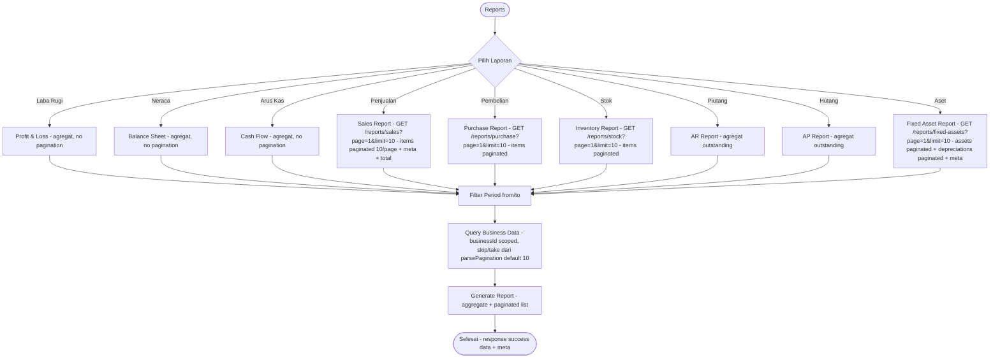

## 15. Relasi Besar Antar Modul

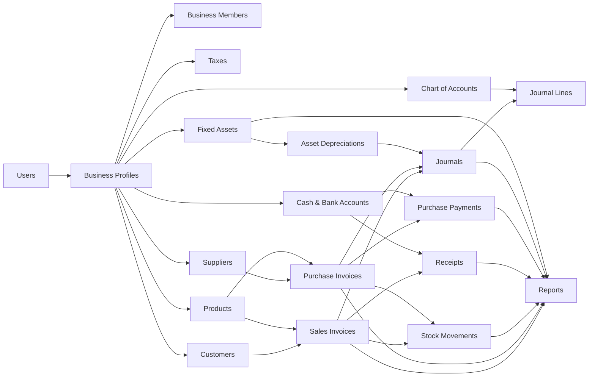

## 16. Multi-Tenant / Business Isolation (pagination scoped)

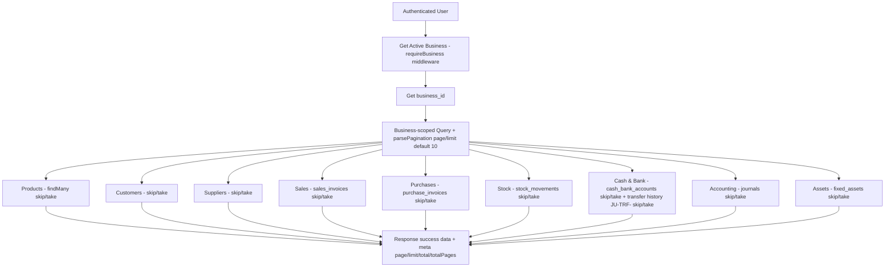

Aturan utama:

```text
User
  ↓
Business Membership
  ↓
business_id
  ↓
Business-scoped Query
  ↓
Business Data
```

## 17. Gambaran Arsitektur Keseluruhan

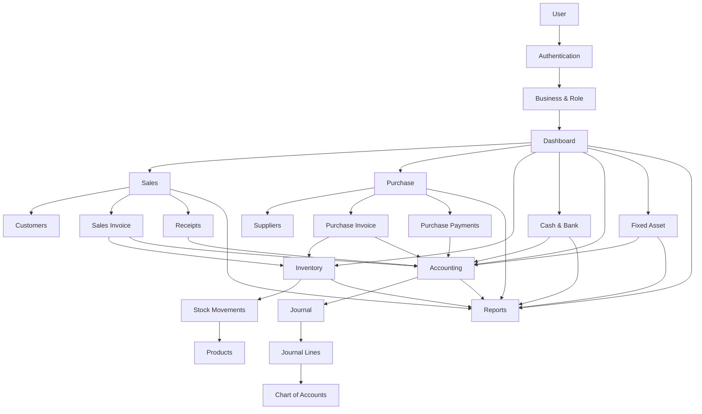

## 18. Core Business Flow

```text
REGISTER / LOGIN
       ↓
BUSINESS
       ↓
DASHBOARD
       ↓
┌──────────────┬──────────────┬──────────────┐
│   PENJUALAN  │   PEMBELIAN  │     STOK     │
└──────┬───────┴──────┬───────┴──────┬───────┘
       ↓              ↓              ↓
   RECEIPT         PAYMENT       MOVEMENT
       │              │              │
       └──────────────┼──────────────┘
                      ↓
                  ACCOUNTING
                      ↓
              JOURNAL & LINES
                      ↓
                   REPORTS
                      ↓
        ┌─────────────┼─────────────┐
        ↓             ↓             ↓
     LABA RUGI      NERACA       ARUS KAS
```

## 19. Ringkasan Modul (sinkron 2026-09-16)

| Modul | Tabel | Pagination 10/page | Penomoran |
|---|---|---|---|
| Authentication | `users` | `GET /users?page=1&limit=10` | - |
| Business | `business_profiles`, `business_members` | `GET /businesses?page=1&limit=10` (businesses.service `listByUser` + `findByUserIdPaginated`) | - |
| COA | `chart_of_accounts` | `GET /chart-of-accounts?page=1&limit=10` | - |
| Tax | `taxes` | `GET /taxes?page=1&limit=10` | - |
| Accounting | `journals`, `journal_lines` | `GET /journals?page=1&limit=10` | `journalNo` auto `JU-SALES-*`, `JU-PURCHASE-*`, `JU-RECEIPT-*`, `JU-PAYMENT-*`, `JU-MANUAL-*`, `JU-TRF-*`, `JU-DEP-*` |
| Cash & Bank | `cash_bank_accounts` | `GET /cash-bank-accounts?page=1&limit=10` | `JU-TRF-*` untuk transfer |
| Cash Transfer History | `journals` filter `JU-TRF-` | `GET /cash-bank-transfers?page=1&limit=10` (baru) | - |
| Product | `products` | `GET /products?page=1&limit=10` | - |
| Inventory | `stock_movements` | `GET /stock-movements?page=1&limit=10`, `GET /reports/stock?page=1&limit=10` | - |
| Customer | `customers` | `GET /customers?page=1&limit=10` | - |
| Sales | `sales_invoices`, `sales_invoice_lines` | `GET /sales-invoices?page=1&limit=10`, `GET /reports/sales?page=1&limit=10` | `invoiceNo` manual atau `prefix` client (default `SI`) → `{prefix}{001}` urut global per businessId via `getNextNoTx` - `src/common/utils/numbering.js:1` |
| Receivable | `receipts` | `GET /receipts?page=1&limit=10` | `receiptNo` manual atau `prefix` default `RC` → `RC001` |
| Supplier | `suppliers` | `GET /suppliers?page=1&limit=10` | - |
| Purchase | `purchase_invoices`, `purchase_invoice_lines` | `GET /purchase-invoices?page=1&limit=10`, `GET /reports/purchase?page=1&limit=10` | `invoiceNo` manual atau `prefix` default `PB` → `PB001` |
| Payable | `purchase_payments` | `GET /purchase-payments?page=1&limit=10` | `paymentNo` manual atau `prefix` default `PP` → `PP001` |
| Fixed Asset | `fixed_assets`, `asset_depreciations` | `GET /fixed-assets?page=1&limit=10`, `GET /asset-depreciations?page=1&limit=10`, `GET /reports/fixed-assets?page=1&limit=10` | - |
| Reports | Data dari seluruh modul | `sales`, `purchase`, `stock`, `fixed-assets` paginated 10/page dengan `meta` | - |

Catatan pagination: semua list pakai `src/common/utils/pagination.js:1` `parsePagination(query)` default `page 1 limit 10 max 100` + `buildMeta` → `response {data, meta: {page,limit,total,totalPages}}`.
Catatan penomoran: prefix bebas 1-20 char dari client, angka `padStart(3,'0')` sequential per `businessId`+`prefix`+tabel, transaksi manual `invoiceNo` tetap didukung (backward compat).
